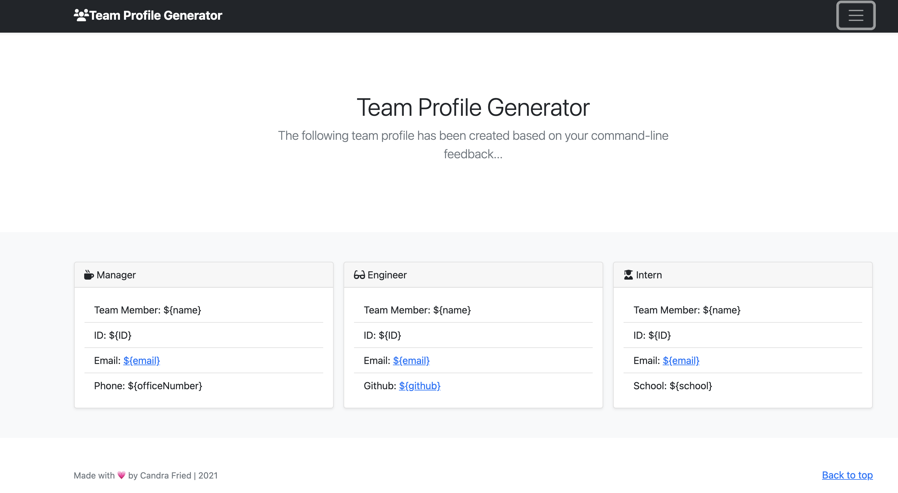

# team-profile-generator
This is a Node.js command-line application that takes in information about  software engineering team employees, then generates an HTML page to display summaries for each individual. Unit testing is then available to make code maintainable, and to ensure each part of the code passes.

## Table of Contents
- [Important URLs](#urls)
- [Foreword](#foreword)
- [Usage](#usage)
- [User Story](#user-story)
- [Acceptance Criteria](#acceptance-criteria)
- [Mockup](#mock-up)
- [Frameworks](#frameworks)
- [License](#licensing)

## URLs
- [GitHub Repo URL](https://github.com/candracodes/team-profile-generator)
- [Video Walk-thru URL](https://watch.screencastify.com/v/tfZDm7TSHwqll95Ga7zy)
- [Generated HTML URL](https://candracodes.github.io/team-profile-generator/dist/index.html)

## Foreword

- This application aims to accomplish the following:
  - The successful use of [Jest](https://www.npmjs.com/package/jest) for running the unit tests and [Inquirer](https://www.npmjs.com/package/inquirer) for collecting input from the user
  - The successful initialization of the application by invoking by the following command: `node index.js` in the command line
  - The successful inclusion of `Employee`, `Manager`, `Engineer`, and `Intern` classes. 
  - The expectation of all tests for the associated classes (in the `tests` directory) to ALL pass.

## Usage

- The application will be invoked by using the following command: `node index.js` 
- This application's directory structure will look as follows:

```md
.
├── tests/             //jest tests
│   ├── Employee.test.js
│   ├── Engineer.test.js
│   ├── Intern.test.js
│   └── Manager.test.js
├── dist/                  // rendered output (HTML) and CSS style sheet      
├── lib/                   // classes
├── src/                   // template helper code 
├── .gitignore             // indicates which folders and files Git should ignore
├── index.js               // runs the application
└── package.json           
```

## User-Story

```md
AS A manager
I WANT to generate a webpage that displays my team's basic info
SO THAT I have quick access to their emails and GitHub profiles

```

## Acceptance-Criteria

```md
GIVEN a command-line application that accepts user input
WHEN I am prompted for my team members and their information
THEN an HTML file is generated that displays a nicely formatted team roster based on user input
WHEN I click on an email address in the HTML
THEN my default email program opens and populates the TO field of the email with the address
WHEN I click on the GitHub username
THEN that GitHub profile opens in a new tab
WHEN I start the application
THEN I am prompted to enter the team manager’s name, employee ID, email address, and office number
WHEN I enter the team manager’s name, employee ID, email address, and office number
THEN I am presented with a menu with the option to add an engineer or an intern or to finish building my team
WHEN I select the engineer option
THEN I am prompted to enter the engineer’s name, ID, email, and GitHub username, and I am taken back to the menu
WHEN I select the intern option
THEN I am prompted to enter the intern’s name, ID, email, and school, and I am taken back to the menu
WHEN I decide to finish building my team
THEN I exit the application, and the HTML is generated
```

## Mock-Up

* This application should resemble the following screenshot and video walk-through:


- [Video Walkthrough](https://watch.screencastify.com/v/tfZDm7TSHwqll95Ga7zy)

## Frameworks

The project is created using the following frameworks and libraries

- [Bootstrap](https://getbootstrap.com/)

## Licensing
The project is made possible with the following licensing:
- [MIT](LICENSE)